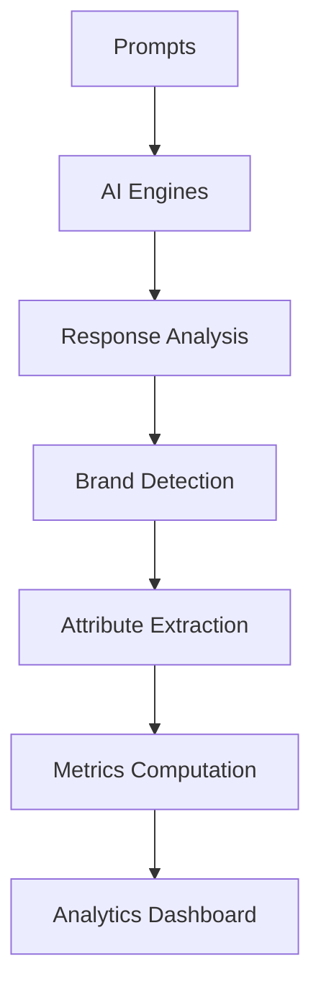

# 🎯 GEORADAR

> AI-powered brand mention analysis tool for comprehensive brand monitoring and competitive intelligence

[](https://www.typescriptlang.org/)
[](https://bun.sh/)
[](https://reactjs.org/)
[](https://nextjs.org/)

## 📖 Overview

GEORADAR is an advanced AI-powered brand mention analysis platform that monitors how brands are discussed in AI-generated content. It analyzes responses from leading LLMs (GPT, Perplexity) to understand brand positioning, sentiment, and competitive dynamics.

### 🎯 Current Focus
- **Construction adhesive and sealant industry analysis**
- **Quilosa brand monitoring and competitive intelligence**
- **Multi-persona AI response analysis for diverse perspectives**

## 🏗️ Architecture

```
GEORADAR/
├── 🎯 apps/radar/          # Core AI processing backend (Bun + Hono + tRPC)
├── 📊 apps/analytics/      # Cube.dev OLAP analytics engine  
├── 🌐 apps/web/           # React dashboard with Zustand state management
├── 🔄 apps/server/        # Analytics API server with tRPC
├── 📓 notebooks/          # Jupyter analysis notebooks
└── 📈 v1dashboard/        # Legacy Python analysis tools
```

## 🚀 Tech Stack

### Backend & AI
- **Runtime**: [Bun](https://bun.sh/) - Ultra-fast JavaScript runtime
- **Framework**: [Hono](https://hono.dev/) - Lightweight web framework
- **Database**: PostgreSQL with [Drizzle ORM](https://orm.drizzle.team/)
- **Queue System**: BullMQ with Redis for async processing
- **AI Integration**: OpenAI GPT + Perplexity with [AI SDK](https://sdk.vercel.ai/)
- **API Layer**: [tRPC](https://trpc.io/) for end-to-end type safety

### Analytics & Visualization  
- **Analytics Engine**: [Cube.dev](https://cube.dev/) for OLAP analytics
- **Frontend**: React 19 with TypeScript
- **State Management**: [Zustand](https://zustand-demo.pmnd.rs/) with Immer
- **UI Components**: [Radix UI](https://www.radix-ui.com/) + [Tailwind CSS](https://tailwindcss.com/)
- **Charts**: [Recharts](https://recharts.org/), D3.js, Plotly.js
- **Data Analysis**: Python with pandas, matplotlib, seaborn

## ⚡ Quick Start

### Prerequisites
- [Bun](https://bun.sh/) >= 1.0
- [Node.js](https://nodejs.org/) >= 18
- [PostgreSQL](https://www.postgresql.org/) >= 14
- [Redis](https://redis.io/) >= 6

### 🔧 Installation

```bash
# Clone the repository
git clone <repository-url>
cd GEORADAR

# Install dependencies
bun install

# Set up environment variables
cp apps/radar/.env.example apps/radar/.env
# Edit .env with your configuration

# Set up database
cd apps/radar
bun run db:push
bun run db:seed
```

### 🚀 Development

```bash
# Start the core radar backend
cd apps/radar
bun dev

# Start analytics engine (separate terminal)
cd apps/analytics  
cube dev

# Start web dashboard (separate terminal)
cd apps/web
bun dev

# Start analytics API server (separate terminal)
cd apps/server
bun dev
```

## 📊 Key Features

### 🤖 AI Processing Pipeline
- **Multi-Engine Support**: OpenAI GPT + Perplexity with web search
- **Persona-Based Analysis**: Diverse AI responses for comprehensive insights
- **Brand Detection**: Advanced NLP for accurate brand mention identification
- **Sentiment Analysis**: Contextual sentiment scoring for brand mentions
- **Competitive Intelligence**: Automated brand comparison and positioning

### 📈 Analytics Dashboard
- **Real-time Metrics**: Live brand performance indicators
- **Interactive Visualizations**: Dynamic charts and data exploration
- **Competitive Analysis**: Side-by-side brand comparisons
- **Persona Insights**: Demographic-specific brand perception
- **Export Capabilities**: PDF reports and data exports

### 🎯 Brand Monitoring
- **Mention Tracking**: Comprehensive brand mention detection
- **Position Analysis**: Brand ranking in AI responses
- **Attribute Mapping**: Automated brand characteristic extraction
- **Trust Signals**: Credibility and authority indicators
- **Market Intelligence**: Industry trend analysis

## 🛠️ CLI Tools

### Analytics CLI
```bash
# Interactive mode
bun run cli:analytics

# Test specific endpoints
bun run cli:analytics --headless \
  --endpoint=attributes.getTopAttributes \
  --params='{"brand":"quilosa","limit":10}'

# List available endpoints
bun run cli:analytics --list
```

### Database Management
```bash
bun run db:push          # Push schema changes
bun run db:studio        # Open Drizzle Studio GUI
bun run db:seed          # Seed initial data
bun run db:materialize   # Update materialized views
```

## 📊 Database Schema

### Core Tables
- `prompts` - Analysis questions and scenarios
- `responses` - AI-generated response content  
- `brands` - Monitored brand entities
- `brand_metrics` - Computed performance indicators
- `response_brands` - Brand mentions in responses
- `response_attributes` - Extracted brand attributes

### Analytics Views
- Materialized views for optimized analytics queries
- Real-time metrics computation
- Competitive benchmarking data

## 🔄 Processing Workflow



## 🌐 API Endpoints

### Radar Backend (`/api`)
- `GET /stats` - System statistics
- `POST /run` - Process prompts
- `GET /ui` - Queue monitoring dashboard

### Analytics API (`/trpc`)
- `attributes.*` - Brand attribute analysis
- `competitive.*` - Competitive intelligence  
- `kpis.*` - Key performance indicators
- `personas.*` - Persona-based insights
- `sources.*` - Source analysis

## 📚 Documentation

- **[CLAUDE.md](./CLAUDE.md)** - AI assistant guidelines and project context
- **[CONFIG_GUIDE.md](./apps/radar/CONFIG_GUIDE.md)** - Configuration documentation
- **[GEORADAR_METRICS_GUIDE.md](./GEORADAR_METRICS_GUIDE.md)** - Analytics methodology
- **[Block Architecture](./apps/web/src/blocks/README.md)** - Frontend architecture guide

## 🧪 Current Analysis Focus

### Brands Monitored
- **Primary**: Quilosa (adhesives and sealants)
- **Competitors**: Ceys, Pattex, Sika, Bostik
- **Industry**: Construction adhesives and building materials

### Key Metrics
- **Mention Score**: Brand visibility and frequency
- **Position Ranking**: Brand placement in AI responses  
- **Sentiment Analysis**: Positive/negative brand perception
- **Competitive Score**: Relative market positioning
- **Trust Indicators**: Authority and credibility signals

## 🚧 Development Status

### ✅ Completed
- Core AI processing pipeline
- Brand detection and analysis
- Analytics dashboard foundation
- Database schema and migrations
- CLI tools and automation

### 🔄 In Progress  
- Zustand state management migration
- Enhanced visualization components
- Real-time analytics updates
- Advanced competitive intelligence

### 📋 Roadmap
- Multi-industry support
- Advanced ML models
- API rate limiting
- Performance optimizations
- Extended brand coverage

## 🤝 Contributing

1. **Fork** the repository
2. **Create** a feature branch (`git checkout -b feature/amazing-feature`)
3. **Commit** your changes (`git commit -m 'Add amazing feature'`)
4. **Push** to the branch (`git push origin feature/amazing-feature`)
5. **Open** a Pull Request

See our [Contributing Guidelines](.github/pull_request_template.md) for detailed information.

## 📄 License

This project is proprietary software. All rights reserved.

## 🆘 Support

- **Issues**: [Create an issue](.github/ISSUE_TEMPLATE/)
- **Documentation**: See `/docs` folder in each app
- **CLI Help**: `bun run cli:analytics --help`

---

**Built with ❤️ for intelligent brand monitoring and competitive analysis**